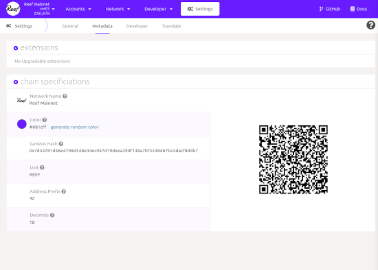
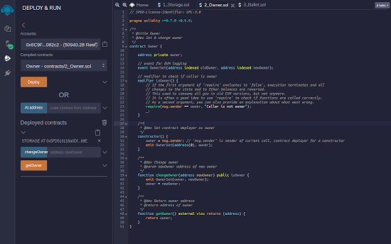
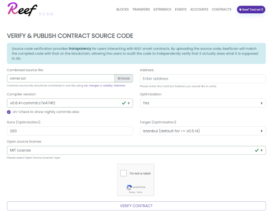

The Reef mainnet is launching in “canary” mode. Reef chain is not just an Ethereum clone - is built from ground up with new blockchain technology, and as such carries risk of potentially disruptive bugs.

For this reason we are opting in for a slow release. The mainnet is available for developers to deploy their Solidity smart contracts and develop DeFi applications using Reef chain.

Our goal for the next quarter is to improve developer tooling and [encourage](https://medium.com/reef-finance/reef-chain-developer-support-program-674819d6dca6) ecosystem development.
Once the chain is deemed stable we will be enabling the liquidity bridge between BSC and Reef chain,
as well as increase the NPoS validator slots.

## Reef Console

Reef Console is a Polkadot.js based UI with native Reef chain support. It is now available at
[https://console.reefscan.com](https://console.reefscan.com)

## Remix IDE

The Remix IDE has seen multiple improvements and can be used to deploy Solidity smart contracts on
Reef Testnet as well as Mainnet. It is available at [https://remix.reefscan.com](https://remix.reefscan.com)

## Solidity Verifier

Reefscan now supports [smart contract validation](https://testnet.reefscan.com/verifyContract/), which enables the public repository of smart contracts source code and ABI's.
Example of verified contract can be found [here](https://testnet.reefscan.com/contract/0xcf9f1e174559b9681b163a0f3985bd3a1434ef9c).

## Developer support
We are inviting developers to join us in [Reef matrix chat](https://app.element.io/#/room/#reef:matrix.org) with any questions related to Reef chain. The developer chat can also be used to interact with the automated Reef chain testnet faucet.
