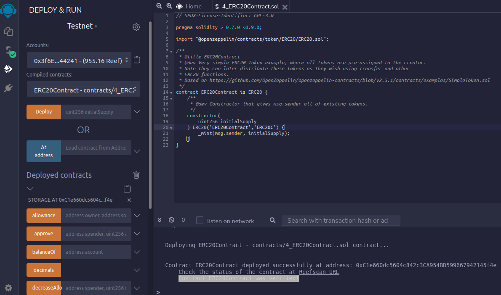
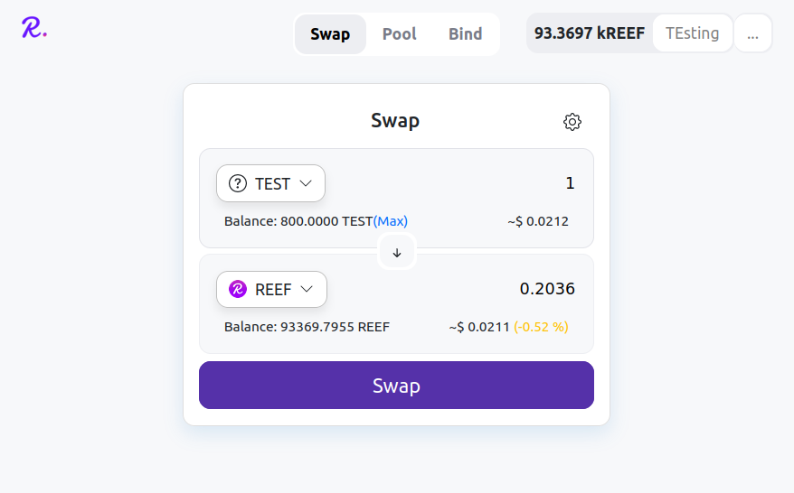
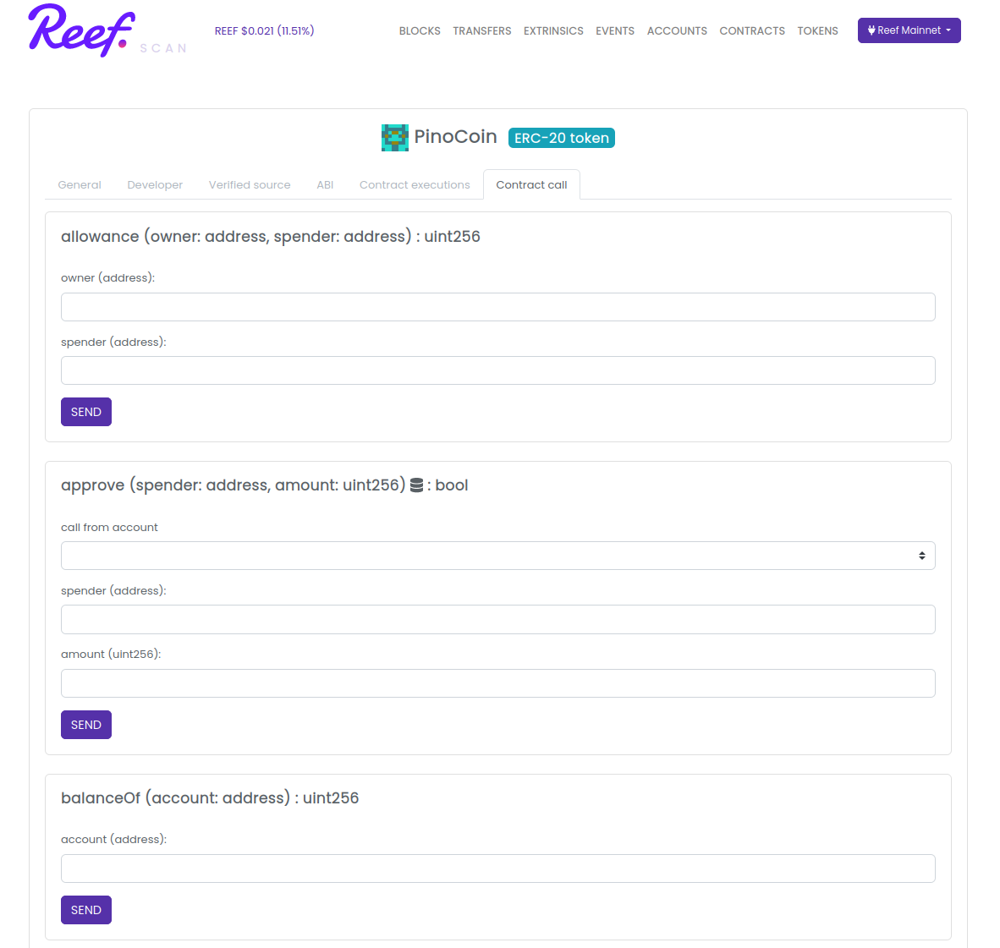

Reef v7 has been activated on mainnet on block [1242424](https://reefscan.com/block/?blockNumber=1242424).

This mainnet upgrade features multiple bugfixes. The Reef node v3.0.1 also makes it easier to start
rpc/boot/validator nodes thanks to embedded wasm genesis runtimes.

The node upgrade is optional, but recommended.

## Ecosystem improvements
Developers should upgrade to the latest versions of our [JavaScript](https://docs.reef.finance/docs/developers/js_libraries/) and [Python](https://github.com/reef-defi/py-reef-interface#readme) libraries.

## Remix ERC-20 Support
[Reef Remix](https://remix.reefscan.com) makes it easy to deploy new tokens. The smart contract deployment and verification
is now fully automated. All you need to do is pick the token name and supply.

## Reefswap is live
[Reefswap](https://reefswap.com) allows anyone to create a Uniswap V2 liquidity pool for their tokens as well as trade ERC-20 tokens on Reef chain.

## Reefscan EVM support
Reefscan now supports full interaction with smart contracts deployed on Reef chain.

## Developer support
We are inviting developers to join us in [Reef matrix chat](https://app.element.io/#/room/#reef:matrix.org) with any questions related to Reef chain. The developer chat can also be used to interact with the automated Reef chain testnet faucet.
