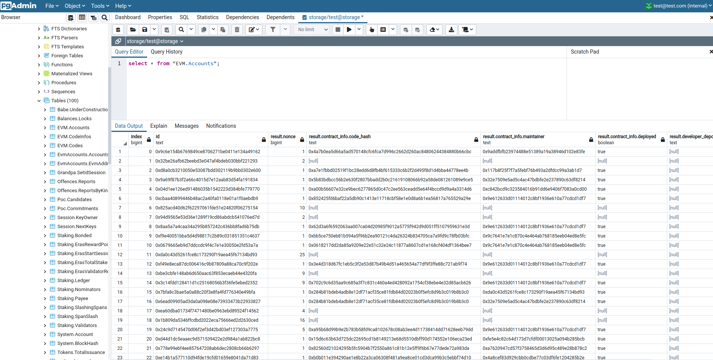
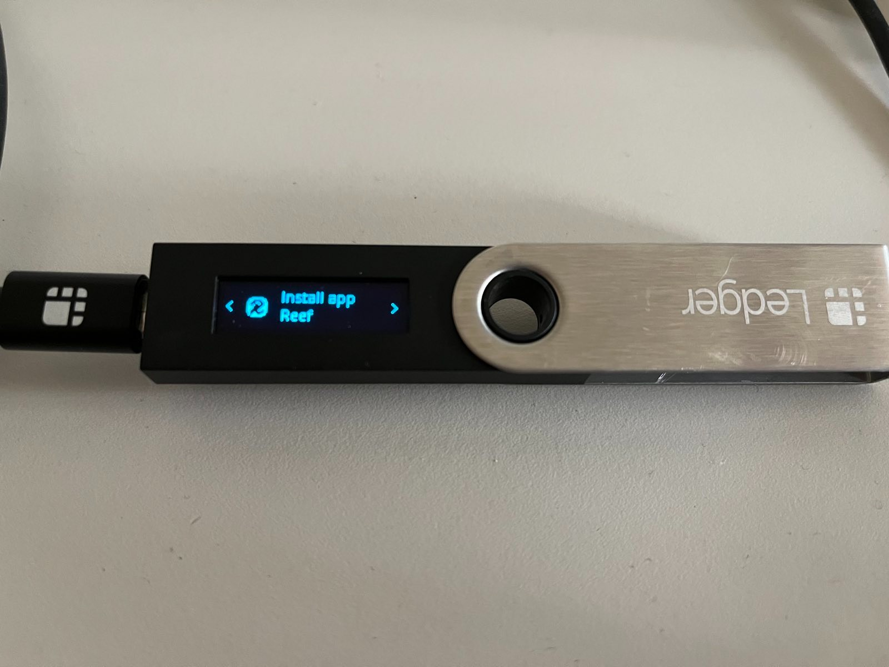

Reef v8 has been activated on mainnet on block [xxxxxxx](https://reefscan.com/block/?blockNumber=1242424).

**Reef v8 is the largest blockchain upgrade since the Reef mainnnet launch on May 28th 2021**:
 - Upgraded from Polkadot Substrate 3 to Substrate 4
 - Upgraded Ethereum virtual machine (EVM) to post London fork
 - Support for live chain forking in development mode
 - Support for blockchain database snapshots /w Postgres mirroring
 - Improved integration tests suite




## Upgrade instructions
This release also requires node upgrade.
All users should upgrade the their Reef node to 4.0.0. Chain re-sync is not required.

```
git checkout v8
make release
```

You can read more about the release [here](https://github.com/reef-defi/reef-chain/releases/tag/v8).
Full node compilation instructions are available [here](/docs/developers/nodes/).

## Ecosystem improvements
Developers should upgrade to the latest versions of our [JavaScript](https://docs.reef.finance/docs/developers/js_libraries/) and [Python](https://github.com/reef-defi/py-reef-interface#readme) libraries.

## Ledger Nano support
Reef chain firmware for Ledger hardware wallets is now available on [GitHub](https://github.com/reef-defi/ledger-reef). The firmware supports native Reef chain transactions related to REEF transfers, bonding and NPoS governance.



A user friendly UI with Ledger support is currently in development.

## Developer support
We are inviting developers to join us in [Reef matrix chat](https://app.element.io/#/room/#reef:matrix.org) with any questions related to Reef chain. The developer chat can also be used to interact with the automated Reef chain testnet faucet.
