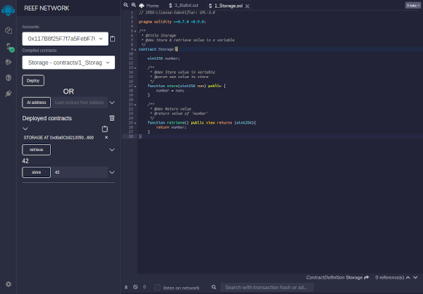

The main focus of this release is extensive testing and deployment of EVM applications on top of Reef chain. With this release we are also inviting new validators to start their node and participate in NPoS elections.

[Spec Sheet](/docs/developers/networks/#reef-testnet) | [Developer Console](https://polkadot.js.org/apps/?rpc=wss%3A%2F%2Frpc-testnet.reefscan.com%2Fws#/explorer) | [Block Explorer](https://testnet.reefscan.com)

## Remix IDE
Developers can use Remix IDE for Reef chain to quickly deploy and test their smart contracts.

You can give Reef Remix a try at [https://remix.reefscan.com](https://remix.reefscan.com/)

## Hardhat support
More advanced developers can now enjoy a native [Hardhat](https://hardhat.org/) integration. Check out our [Reef Hardhat](https://github.com/reef-defi/hardhat-reef) page to get started.

## Testnet Faucet
The testnet faucet chatbot is live. To get 1000 REEF testnet tokens simply type `!drip <YOUR_ADDRESS>` in [Reef matrix chat](https://app.element.io/#/room/#reef:matrix.org).
