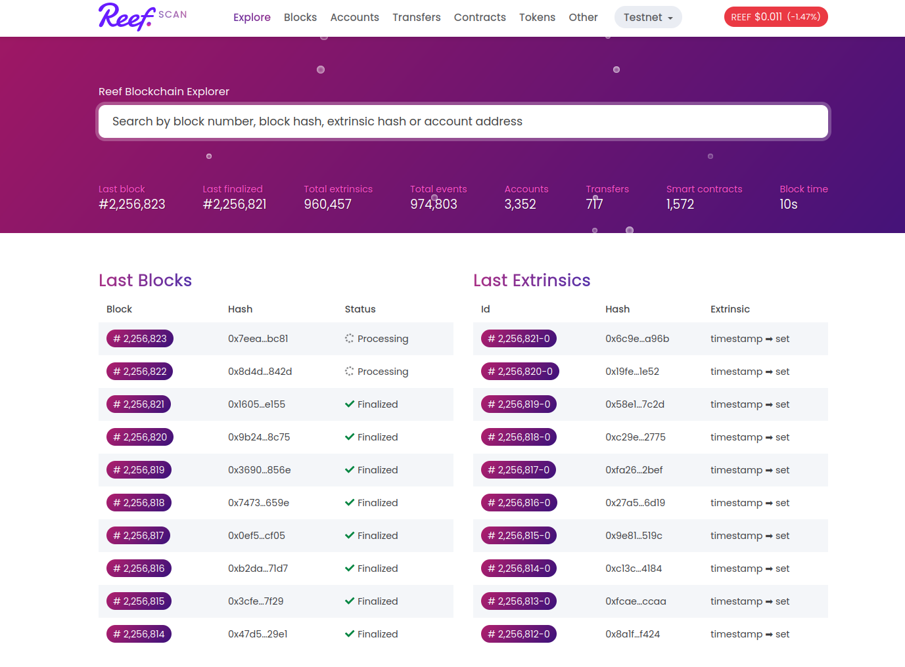
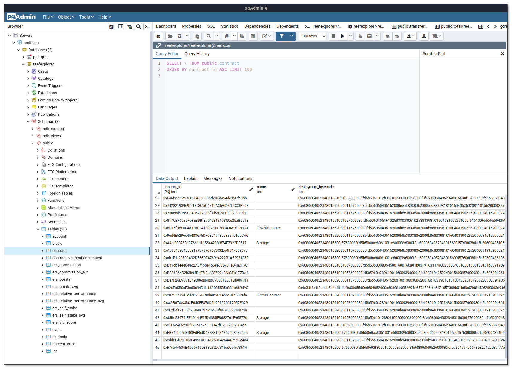
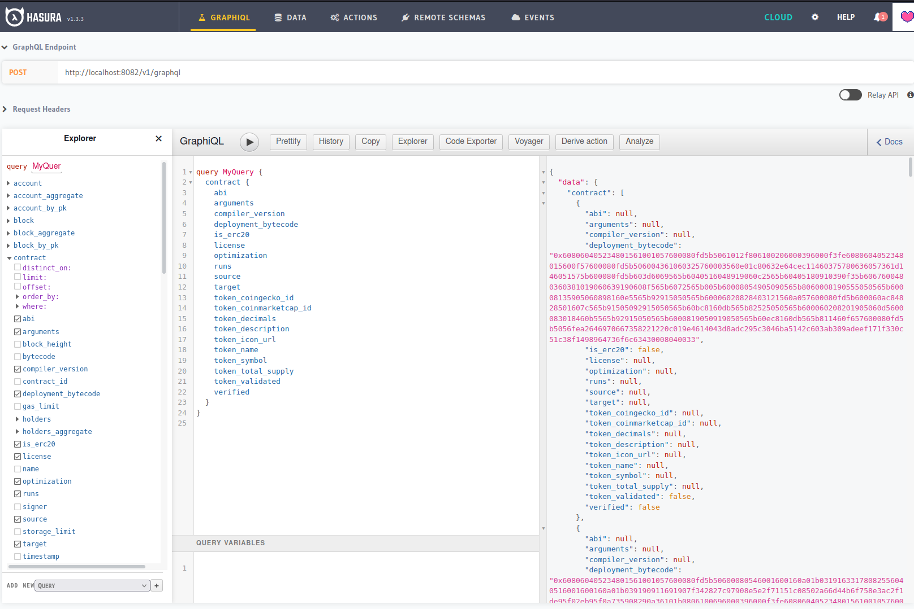

[Reefscan](https://reefscan.com) is the most advanced, fully open-source block explorer. It was built from
the ground up for Reef chain and DeFi.

## Reefscan UI Redesign
Reefscan has a new look. It is the first Reef project utilizing components from the upcoming [Reef UI kit](/docs/developers/ui_kit/).



## ERC-20 Token Tracker
Reefscan will now automatically label and track smart contracts that satisfy ERC-20 contract interface.
This gives users the full transparency into token holdings and token movements on chain.

## The Graph
Reefscan's choice of database backend - Postgres - will certainly delight many software engineers.
However we have received a lot of requests for "The graph". Fortunately, Reefscan also ships with
Hasura GraphQL server which makes it easy for web developers to connect with Reef chain
data warehouse for faster and more powerful frontend applications.

Fetch smart contracts example with Postgres:


Fetch smart contracts example with GraphQL:


Check out the [Reefscan documentation](/docs/developers/reefscan/) to learn how to access the graph
and other features.

## Reefscan APIs
Reefscan also ships with multiple API endpoints that are useful for quickly implementing wallet
enhancements and other features:
 - An API for listing user's tokens and balances
 - An API for historic trading data on Reefswap DEX
 - An API for programmatically verifying smart contracts source code
 - An API for retreiving verified smart contract's source and ABI
 - and [more](/docs/developers/reefscan/#smart-contracts)

## Full Docker support
Reefscan runs in Docker. Setting up the full Reefscan stack (Postgres, GraphQL, Backend & Frontend)
is as easy as:
```
yarn
yarn workspace backend docker:mainnet
yarn workspace frontend generate
```
Check out the full [documentation](https://github.com/reef-defi/reef-explorer#readme) on setting up and configuring your own, production grade instance of Reefscan.
